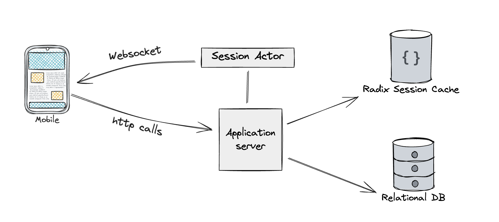

# CHECK24 GenDev Messenger Challenge

## Run locally

```bash
# Start the server
cd server 
docker-compose up -d

# Start the client
cd client
npm install
npm run dev
```

## Approach



I started this project with one goal:

> use all the cool new technologies that I didn't use before.

We have a simple client/server architecture.
Due to the requirement to send and receive notifications in real time, I decided to use websockets.

Messages are sent to the application server with a rest api,
which persists them in the database and notifies recipients if they have an active session.

### Lessons learned

1. If you want to get a project done quickly, don't use a framework that has around 10000 active users.
1. If you want to get a project done quickly, use a language you already know by heart. (And maybe more high level than rust)
1. Making mistakes in the initial system design is fine, as long as you are able to rectify them later on.

### API

- [Actix and Actix Web](https://actix.rs/) - Actor framework and web server
- [SeaORM](https://www.sea-ql.org/SeaORM/) - Migrations, ORM
- [PostreSQL](https://www.postgresql.org/) - Relational Database

### Web client

- [Svelte Kit](https://kit.svelte.dev/) - UI Framework
- [TailwindCSS](https://tailwindcss.com/) - CSS Framework
- [SkeletonUI](https://www.skeleton.dev/) - UI Library

## Future work

- Authentication
- Bug fixes
- Sent/Received receipts
- Scalability
